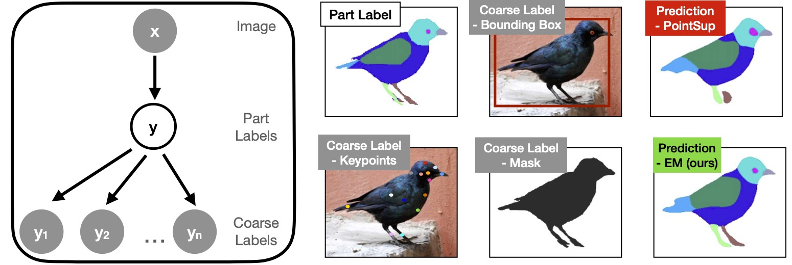

# CoarseSup

This is the code using coarse labels to improve few-shot part segmentation proposed in

#### Improving Few-Shot Part Segmentation using Coarse Supervision

[Oindrila Saha](http://oindrilasaha.github.io), [Zezhou Cheng](http://sites.google.com/site/zezhoucheng/), [Subhransu Maji](http://people.cs.umass.edu/~smaji/) 

ECCV'22

[[arXiv]](https://arxiv.org/abs/2204.05393) [[Project page]](https://people.cs.umass.edu/~osaha/coarsesup/)



## Preparation

Create a conda environment with the specifications
```
conda create --name <env name> --file spec-file.txt
conda activate <env name>
```
-> Download PASCUB dataset from [here](https://drive.google.com/drive/folders/1zCOlttyhv1z9AALGTBtBVXYLtBO3-clQ?usp=sharing)

-> Download the full CUB dataset (images and segmentations) from [here](https://www.vision.caltech.edu/datasets/cub_200_2011/)
and extract images into single folder by:

```
cd <path to cub data>/images/ 
for folder in *; do cp $folder/* ../images_extracted/.; done
```

-> Download pretained checkpoints from [here](https://drive.google.com/drive/folders/1EqAiUKdKc_jF-DaTWyCWHh7h6KNEU7UJ?usp=sharing) into checkpoints_pretrained folder inside current folder

## Training - Posterior Network

```bash
cd Posterior

python main_yp_ykymx.py --data_pascal_images <path to PASCUB Birds>/CUB_Parts/images_train/ --data_pascal_parts <path to PASCUB Birds>/CUB_Parts/parts_train/

```

Use main_yp_ykx.py for training posterior only using keypoints as coarse labels.
Use main_yp_ymx.py for training posterior only using figure-ground masks as coarse labels.

This code will save the checkpoints in the Posterior folder in folders with prefix 'checkpoints_Posterior'.

## Training - EM

We provide the pretrained model for initializing the part segmentation model (yp|x) and the coarse supervision model (yk|yp) in 'checkpoints_pretrained'. The posterior model should be initialized using the last saved "best_model" in previous step.

```bash
cd JointPartSegmentation

python main_birds.py --data_cub_images <path to PASCUB Birds>/CUB_Parts/images_train/ --data_cub_parts <path to PASCUB Birds>/CUB_Parts/parts_train/ --data_pascal_images <path to PASCUB Birds>/PASCAL_Parts/images_train/ --data_pascal_parts <path to PASCUB Birds>/PASCAL_Parts/parts_train/ --data_cub_images_full <path to CUB dataset>/images_extracted/ --data_cub_masks_full <path to CUB dataset>/segmentations/  —posterior_ckpt <path to posterior last best model> --epochs 40 --keypoint True --mask True --exp_name kpandmask

```

The flags --keypoint and --mask denote whether these will be used for coarse supervision. Note that the corresponding posterior model needs to be loaded. The flag --exp_name is used to create the folder name where checkpoints will be saved.

This code will save checkpoints in the JointPartSegmentation folder as 'checkpoints_JointPartSegmentation_<exp_name>'.

## Testing

```
python test_miou.py --resume <path to saved em model> --data_images <path to images> --data_parts <path to part labels>
```

The above code prints the mIoU for the trained em model. 

The flags --data_images and --data_parts can be used to check mIoU on PASCAL/CUB test/val sets. For example, 
```
--data_images <path to PASCUB Birds>/CUB_Parts/images_test --data_parts <path to PASCUB Birds>/CUB_Parts/parts_test
```

For the best EM model this code should print a mIoU of 48.05.

## Citation
If you use this code for your research, please cite the following paper.

```
@article{saha2022improving,
  title={Improving Few-Shot Part Segmentation using Coarse Supervision},
  author={Saha, Oindrila and Cheng, Zezhou and Maji, Subhransu},
  booktitle = {European conference on computer vision},
  year={2022}
}
```
